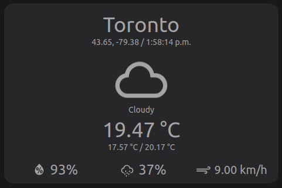

# Weather Tracker &middot; [](https://github.com/kajgm/weathertracker/blob/master/LICENSE) [](https://github.com/kajgm/weathertracker/actions/workflows/node.js.yml) 

A minimal tracker for Weather. Intended for use on external Raspberry Pi based displays (3.5inch) or within a browser.



## Developed With

- [Node](https://nodejs.org/)
- [Vue](https://vuejs.org/)
- [Vite](https://vitejs.dev/)
- [Tailwindcss](https://tailwindcss.com/)

## Prerequisites

1. Please ensure the following software is installed

- [Node](https://nodejs.org/en/download)

## Project Setup

### Install dependencies

```sh
npm install
```

### Compile and Hot-Reload for Development

```sh
npm run dev
```

### Type-Check, Compile and Minify for Production

```sh
npm run build
```

### Run Unit Tests with [Vitest](https://vitest.dev/)

```sh
npm run test
```

### Lint with [ESLint](https://eslint.org/)

```sh
npm run lint
```

## Docker Deployment

To deploy within Docker, please follow these steps:

1. Install [Docker Engine](https://docs.docker.com/engine/install/)

   > Tip: If running on a raspberrypi, follow these docs: [install](https://docs.docker.com/engine/install/debian/)

2. Build the dockerfile within the client directory
   > Tip: Run `sudo usermod -aG docker <user>` to avoid prefixing the following commands with sudo

```
docker build -t kajgm/weathertracker .
```

3. Run the dockerfile

```
docker run -d -p 8080:80 --name weathertracker-1 kajgm/weathertracker
```

## Deployment on Raspberry Pi

Ensure the Docker deployment steps from above are followed on the target Raspberry Pi

1. If running these commands over ssh, export the display

```
export DISPLAY=:0
```

2. Run chromium in fullscreen mode

```
chromium-browser --kiosk --app=http://localhost:8080/ --start-fullscreen --incognito
```

> Alternatively, you may have to append `nohup` and `&` to run the command in the background (if executing via ssh):

```
nohup chromium-browser --kiosk --app=http://localhost:8080/ --start-fullscreen --incognito &
```

### Auto start

1. Give the startup.sh file executable permissions

```
chmod +x startup.sh
```

2. To enable script auto start on bootup, create an entry within `~/.config/autostart/.desktop` with the following lines:
   > make sure to edit the `<username>` field with your username

```
[Desktop Entry]
Version=1.0
Type=Application
Terminal=false
Exec='/home/<username>/weathertracker/startup.sh'
Name=weathertracker
```

### Troubleshooting

1. Issues with chromium-browser: Install chromium browser version 88
   > For whatever reason the latest version of chromium-browser sometimes doesn't play nice. If you're running into issues with the next few commands, try installing this version.

```
wget "http://archive.raspberrypi.org/debian/pool/main/c/chromium-browser/chromium-browser_88.0.4324.187-rpt1_armhf.deb"
wget "http://archive.raspberrypi.org/debian/pool/main/c/chromium-browser/chromium-codecs-ffmpeg-extra_88.0.4324.187-rpt1_armhf.deb"
apt install --no-install-recommends --allow-downgrades --allow-change-held-packages ./chromium-browser_88.0.4324.187-rpt1_armhf.deb ./chromium-codecs-ffmpeg-extra_88.0.4324.187-rpt1_armhf.deb
```

2. Raspberry pi screen sleeping: Set the raspberrypi config settings

```
sudo raspi-config
```

Select 2 Display Options > D2 Screen Blanking > No > Finish
